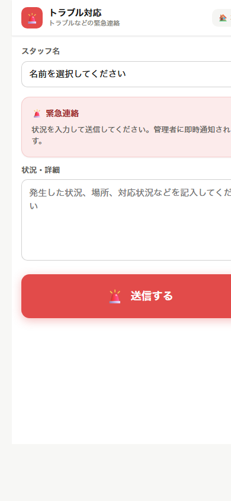

# P-CUBE 業務連絡システム　スタッフ使い方ガイド

> このガイドは、スマートフォンのLINEしか使ったことがない方でも読めるように書かれています。
> 画像を見ながら、ひとつひとつ確認してください。

---

## まず最初にやること ― LINEで友達登録

このシステムはLINEと連動しています。
最初に、P-CUBEの **LINE公式アカウントを友達登録** してください。
友達登録することで、LINEからシステムへの通知が届くようになります。

### 友達登録の手順

**① LINEアプリを開きます**

スマートフォンの画面にある「LINE」アイコンをタップしてください。

---

**② 友だち追加画面を開きます**

画面上部の「友だち追加」（人型のアイコン）をタップ → **「QRコード」** を選んでください。

---

**③ 下のQRコードを読み取ります**

<div align="center">


> ※ このQRコードをLINEのカメラで読み取ってください

</div>

> **【管理者向け注意】** `docs/screenshots/line_qr.png` に
> LINE公式アカウントの友達登録用QRコード画像を配置してください。

---

**④ 「追加」ボタンをタップして完了**

「P-CUBEシステム」という名前のアカウントが追加されれば成功です。

---

## システムを開く方法

友達登録が終わったら、下のURLからシステムにアクセスできます。

**システムのURL:**
```
https://pcube-inc.github.io/jimaku-system/
```

> **ポイント:** LINEのトーク画面から届いたリンクをタップすると、**名前が自動で入力されます**。
> 普通のブラウザ（Safariや Chromeなど）から開いた場合は、自分で名前を選ぶ必要があります。

---

## メインメニュー ― 最初に表示される画面

システムを開くと、次のような画面が表示されます。


5つのメニューがあります。

| メニュー | 何をするもの？ |
|--------|------------|
| **シフト管理** | 出勤できる日を登録したり、確定したシフトを確認する |
| **起床確認** | 出勤日の朝に「起きました」とボタンを押す |
| **出退勤連絡** | 職場に着いたとき・帰るときにボタンを押す |
| **トラブル対応** | 現場でトラブルが起きたときに緊急連絡する |
| **管理者設定** | ※スタッフは使用しません（パスワードが必要） |

タップしたいメニューを押してください。

---

## ① シフト管理 ― 出勤できる日を登録する

「シフト管理」をタップすると、以下の画面が開きます。


### 画面の見かた

画面の上部に **3つのタブ** があります：

- **シフト希望**（最初に開くタブ）― 出勤できる日を登録する
- **希望一覧** ― 自分が登録した希望を確認する
- **シフト確認** ― 確定したシフトを確認する

### シフト希望の登録手順

**① 自分の名前を選ぶ**

「スタッフ名」の欄をタップして、一覧から自分の名前を選んでください。
LINEから開いた場合は自動で入力されます。

---

**② カレンダーで日付を選ぶ**

カレンダーに出勤できる日が表示されています。
登録したい日付をタップしてください。

---

**③ 希望の区分を選ぶ**

日付をタップすると、3つのボタンが表示されます：

| ボタン | 意味 |
|-------|------|
| **✓ OK** | 出勤できる（OK） |
| **△ 応相談** | 出勤できるかもしれない（要相談） |
| **× 休み** | 出勤できない（休み） |

どれかをタップすると、カレンダーに色がつきます。

---

**④ 提出期限に注意**

画面上部に「提出期限（〇月〇日まで）を過ぎています」と表示されていたら、
直接担当者に連絡してください。

---

### シフトの確認

タブ「シフト確認」をタップすると、確定したシフトが表示されます。
出勤日を忘れずに確認してください。

---

## ② 起床確認 ― 出勤日の朝にボタンを押す

「起床確認」をタップすると、以下の画面が開きます。


### この機能について

出勤日の朝、決められた時刻（例：8:00）までに「起床ボタン」を押すことで、
管理者に「起きました」と自動で伝えられます。

**ボタンを押さないと、管理者に「未確認」のメール通知が自動送信されます。**
出勤日は必ず押してください。

### 使い方

**① LINEのリマインダーを受け取る**

出勤日の朝（例：7:00）にLINEから「起床確認をしてください」というメッセージが届きます。
そのメッセージ内のリンクをタップしてください。

---

**② 名前を確認する**

LINEから開いた場合、画面に自分の名前が自動で表示されます。

自分の名前が表示されていない場合は、「スタッフ名」の欄をタップして、
一覧から自分の名前を選んでください。

---

**③ 起床ボタンをタップする**

大きな緑色の「🌄 起床」ボタンが表示されたら、タップします。

「✅ 送信しました」と表示されれば完了です。

---

> **よくある質問**
> **「起床ボタンが表示されない」**
> → 名前が選択されていない可能性があります。スタッフ名を選んでください。
>
> **「すでに送信済みです」と表示される**
> → 今日は既に起床確認済みです。問題ありません。

---

## ③ 出退勤連絡 ― 出勤・退勤のときにボタンを押す

「出退勤連絡」をタップすると、以下の画面が開きます。


### 画面の見かた

- 上に「スタッフ名」の選択欄
- 大きな **緑色の「🏢 出勤」ボタン**
- 大きな **青色の「🏠 退勤」ボタン**

### 出勤のとき

**① 自分の名前を確認する**

名前が自動で入っているか確認してください。入っていない場合は選んでください。

---

**② 緑の「出勤」ボタンをタップする**

職場に到着したら、緑の「🏢 出勤」ボタンをタップします。

---

**③ 確認ダイアログが表示される**

「出勤を記録しますか？」という確認画面が出ます。
問題なければ **「OK」** をタップしてください。

「○○:○○ に出勤を記録しました」と表示されれば完了です。
管理者にメールで通知されます。

---

### 退勤のとき

**① 青の「退勤」ボタンをタップする**

帰るときに、青の「🏠 退勤」ボタンをタップします。
「退勤を記録しますか？」という確認画面が出たら **「OK」** をタップします。
「○○:○○ に退勤を記録しました」と表示されれば完了です。

---

> **注意:** 出勤・退勤は必ずその場でボタンを押してください。
> 後から変更することはできません。不明な場合は管理者に直接連絡してください。

---

## ④ トラブル対応 ― 現場でトラブルが起きたとき

「トラブル対応」をタップすると、以下の画面が開きます。



### この機能について

現場でトラブルが発生したときに、管理者へ **すぐに緊急連絡** するための機能です。
ボタンを押すと、管理者のメールに即座に通知が届きます。

### 使い方

**① 自分の名前を確認する**

「スタッフ名」の欄に自分の名前が入っているか確認してください。

---

**② 状況・詳細を入力する**

「状況・詳細」のテキストボックスに、トラブルの内容を入力します。

例：
```
機材の電源が入らない。
場所は○○スタジオの収録ブース。
現在、スタッフ○○が対応中。
```

入力できる情報を書いてください。わからないことは空欄でも構いません。

---

**③ 赤い「送信する」ボタンをタップする**

赤い「🚨 送信する」ボタンをタップします。

---

**④ 確認ダイアログが表示される**

「管理者へ緊急連絡を送信しますか？」という確認画面が出ます。
**「OK」** をタップしてください。
「✅ 送信しました。管理者に通知されました。」と表示されれば完了です。

---

> **緊急の場合は電話も併用してください。**
> このシステムはメール通知なので、管理者がすぐ見られない可能性があります。
> 急を要するときは電話でも連絡してください。

---

## 困ったときは

### 名前が自動入力されない

LINEから開いていない場合や、初めてシステムを使う場合に起こります。
「スタッフ名」のドロップダウンから自分の名前を選んでください。

自分の名前が一覧に出てこない場合は、**管理者に連絡** してください。
管理者があなたの名前をシステムに登録します。

---

### ボタンを押したが「送信しました」が表示されない

電波状況が悪い可能性があります。Wi-Fiや電波の状況を確認して、
もう一度タップしてください。

---

### LINEのリマインダーが届かない

P-CUBEのLINEアカウントをブロックしていないか確認してください。
LINEの「友だち」一覧から P-CUBE を探して、ブロック解除してください。

---

### システムの画面が崩れて見える・開かない

一度ブラウザを閉じて、LINEのメッセージにあるリンクから開き直してください。
それでも解決しない場合は管理者に連絡してください。

---

## 連絡先

システムや操作に関するご不明な点は、担当者・管理者にお問い合わせください。
