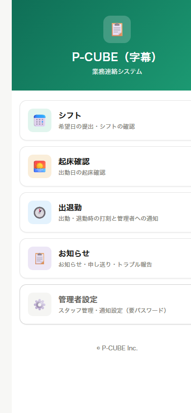
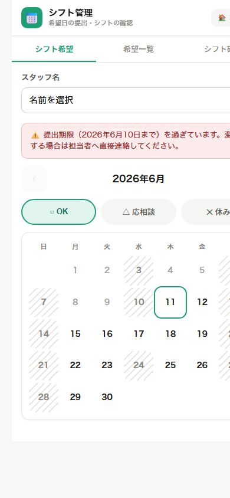
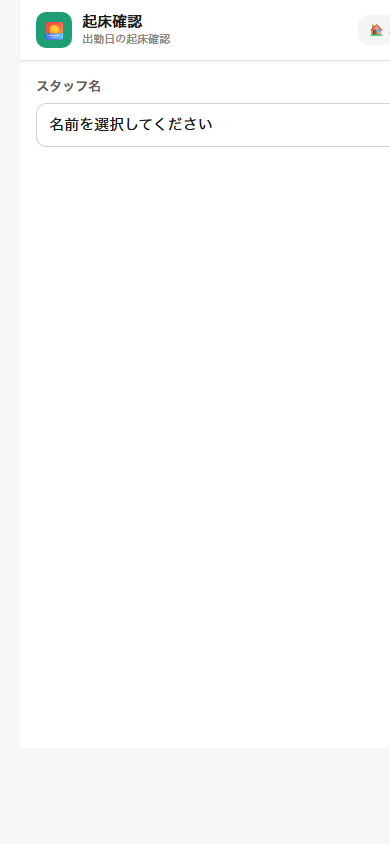
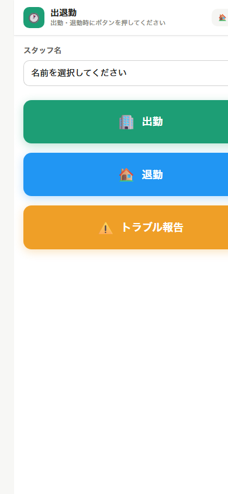
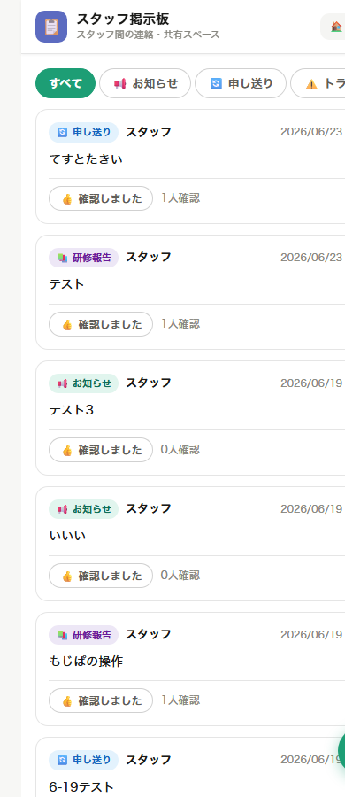

# P-CUBE 業務連絡システム　スタッフ使い方ガイド

> このガイドは、スマートフォンのLINEしか使ったことがない方でも読めるように書かれています。
> 画像を見ながら、ひとつひとつ確認してください。

---

## まず最初にやること ― LINEで友達登録

このシステムはLINEと連動しています。
最初に、P-CUBEの **LINE公式アカウントを友達登録** してください。
友達登録することで、LINEからシステムへの通知が届くようになります。

### 友達登録の手順

**① LINEアプリを開きます**

スマートフォンの画面にある「LINE」アイコンをタップしてください。

---

**② 友だち追加画面を開きます**

画面上部の「友だち追加」（人型のアイコン）をタップ → **「QRコード」** を選んでください。

---

**③ 下のQRコードを読み取ります**

<div align="center">


> ※ このQRコードをLINEのカメラで読み取ってください

</div>

> **【管理者向け注意】** `docs/screenshots/line_qr.png` に
> LINE公式アカウントの友達登録用QRコード画像を配置してください。

---

**④ 「追加」ボタンをタップして完了**

「P-CUBEシステム」という名前のアカウントが追加されれば成功です。

---

## システムを開く方法

友達登録が終わったら、下のURLからシステムにアクセスできます。

**システムのURL:**
```
https://pcube-inc.github.io/jimaku-system/
```

> **ポイント:** LINEのトーク画面から届いたリンクをタップすると、**名前が自動で入力されます**。
> 普通のブラウザ（Safariや Chromeなど）から開いた場合は、自分で名前を選ぶ必要があります。

---

## メインメニュー ― 最初に表示される画面

システムを開くと、次のような画面が表示されます。



5つのメニューがあります。

| メニュー | 何をするもの？ |
|--------|------------|
| **シフト** | 出勤できる日を登録したり、確定したシフトを確認する |
| **起床確認** | 出勤日の朝に「起きました」とボタンを押す |
| **出退勤** | 職場に着いたとき・帰るときにボタンを押す。トラブル報告もここから |
| **お知らせ** | お知らせ・申し送り・トラブル報告・研修報告をスタッフ間で共有する |
| **管理者設定** | ※スタッフは使用しません（パスワードが必要） |

タップしたいメニューを押してください。

---

## ① シフト ― 出勤できる日を登録する

「シフト」をタップすると、以下の画面が開きます。



### 画面の見かた

画面の上部に **3つのタブ** があります：

- **シフト希望**（最初に開くタブ）― 出勤できる日を登録する
- **希望一覧** ― 自分が登録した希望を確認する
- **シフト確認** ― 確定したシフトを確認する

### シフト希望の登録手順

**① 自分の名前を選ぶ**

「スタッフ名」の欄をタップして、一覧から自分の名前を選んでください。
LINEから開いた場合は自動で入力されます。

---

**② カレンダーで日付を選ぶ**

カレンダーに出勤できる日が表示されています。
登録したい日付をタップしてください。

---

**③ 希望の区分を選ぶ**

日付をタップすると、3つのボタンが表示されます：

| ボタン | 意味 |
|-------|------|
| **✓ OK** | 出勤できる（OK） |
| **△ 応相談** | 出勤できるかもしれない（要相談） |
| **× 休み** | 出勤できない（休み） |

どれかをタップすると、カレンダーに色がつきます。

---

**④ 提出期限に注意**

画面上部に「提出期限（〇月〇日まで）を過ぎています」と表示されていたら、
直接担当者に連絡してください。

---

### シフトの確認

タブ「シフト確認」をタップすると、確定したシフトが表示されます。
出勤日を忘れずに確認してください。

自分の名前の横に **業務の種類**（リスピーク／もじぱ／研修）が表示されることがあります。
「---」と表示されている場合は、業務の種類が未定という意味です。

---

## ② 起床確認 ― 出勤日の朝にボタンを押す

「起床確認」をタップすると、以下の画面が開きます。



### この機能について

出勤日の朝、決められた時刻（例：8:00）までに「起床ボタン」を押すことで、
管理者に「起きました」と自動で伝えられます。

**ボタンを押さないと、管理者に「未確認」のメール通知が自動送信されます。**
出勤日は必ず押してください。

### 使い方

**① LINEのリマインダーを受け取る**

出勤日の朝（例：7:00）にLINEから「起床確認をしてください」というメッセージが届きます。
そのメッセージ内のリンクをタップしてください。

---

**② 名前を確認する**

LINEから開いた場合、画面に自分の名前が自動で表示されます。

自分の名前が表示されていない場合は、「スタッフ名」の欄をタップして、
一覧から自分の名前を選んでください。

---

**③ 起床ボタンをタップする**

大きな緑色の「🌄 起床」ボタンが表示されたら、タップします。

「✅ 送信しました」と表示されれば完了です。

---

> **よくある質問**
> **「起床ボタンが表示されない」**
> → 名前が選択されていない可能性があります。スタッフ名を選んでください。
>
> **「すでに送信済みです」と表示される**
> → 今日は既に起床確認済みです。問題ありません。

---

## ③ 出退勤 ― 出勤・退勤のときにボタンを押す

「出退勤」をタップすると、以下の画面が開きます。



### 画面の見かた

- 上に「スタッフ名」の選択欄
- 大きな **緑色の「🏢 出勤」ボタン**
- 大きな **青色の「🏠 退勤」ボタン**
- 大きな **オレンジ色の「⚠️ トラブル報告」ボタン**

> **大事なポイント：ボタンが押せるのはシフトが入っている日だけです。**
> 今日のシフトに入っていない日は、3つのボタンすべてが薄い色になって押せません。
> 画面に「⚠️ 本日のシフトに入っていないため、出退勤の記録はできません。」と表示されます。
> シフトに入っているはずなのに押せない場合は、管理者に連絡してください。

### 出勤のとき

**① 自分の名前を確認する**

名前が自動で入っているか確認してください。入っていない場合は選んでください。

---

**② 緑の「出勤」ボタンをタップする**

職場に到着したら、緑の「🏢 出勤」ボタンをタップします。

---

**③ 確認ダイアログが表示される**

「出勤を記録しますか？」という確認画面が出ます。
問題なければ **「OK」** をタップしてください。

「○○:○○ に出勤を記録しました」と表示されれば完了です。
管理者にメールで通知されます。

---

### 退勤のとき

**① 青の「退勤」ボタンをタップする**

帰るときに、青の「🏠 退勤」ボタンをタップします。
「退勤を記録しますか？」という確認画面が出たら **「OK」** をタップします。
「○○:○○ に退勤を記録しました」と表示されれば完了です。

---

> **注意:** 出勤・退勤は **1日に1回ずつ** です。
> 送信すると、ボタンが「✅ 本日は送信済みです」に変わって押せなくなります。
> （別のスマホやブラウザから開いても、送信済みならボタンは押せません）
> 間違えて押してしまった場合や、時刻を直したい場合は、管理者に直接連絡してください。

---

### トラブルが起きたとき ― 「トラブル報告」ボタン

現場でトラブルが起きたら、オレンジ色の「⚠️ トラブル報告」ボタンをタップします。
報告フォームが開きます。

**① 緊急のときは、まず電話**

フォームの一番上に、**赤い枠で緊急連絡先の電話番号** が大きく表示されます。
急ぎのトラブルのときは、まずその番号に電話してください（番号をタップすると発信できます）。
電話が終わったら、下のフォームにも内容を記入して送信してください。

急ぎでない場合は、電話せずフォームだけで報告してかまいません。

---

**② フォームに入力する**

| 項目 | 書くこと |
|------|---------|
| **発生時刻** | トラブルが起きた時刻（自動で今の時刻が入っています） |
| **状況・内容** | 何が起きたか（必須） |
| **対応内容** | どう対応したか（わからなければ空欄でOK） |

---

**③ 「📧 管理者に送信する」をタップする**

「✅ 送信しました」と表示されれば完了です。管理者にメールで通知されます。

---

## ④ お知らせ ― お知らせ・申し送りをみんなで共有する

「お知らせ」をタップすると、以下の画面が開きます。



### この機能について

スタッフ同士や管理者との **連絡・共有スペース** です。
新しい投稿が上から順に表示されます。

> **必ずLINEから開いてください。**
> 投稿・「確認しました」ボタン・編集・削除は、LINEから開いたときだけ使えます。
> （普通のブラウザから開くと、読むことだけできます）

投稿には4つの種類があります：

| 種類 | 使いどき |
|------|---------|
| **📢 お知らせ** | みんなに知らせたいこと |
| **🔄 申し送り** | シフト交代時の連絡・引き継ぎなど |
| **⚠️ トラブル報告** | トラブルの共有（投稿するとLINEでも通知されます） |
| **📚 研修報告** | 研修を受けた内容の報告 |

画面上部のタブ（すべて／お知らせ／申し送り／トラブル／研修報告）をタップすると、
その種類の投稿だけに絞って表示できます。

### 投稿を読んだら「確認しました」を押す

各投稿の下にある **「👍 確認しました」** ボタンをタップしてください。
「✅ 確認済み」に変わり、「○人確認」の数が増えます。
これで投稿した人が「誰が読んでくれたか」を確認できます。

### 投稿のしかた

**① 画面右下の緑の「✏️」ボタンをタップする**

投稿フォームが開きます。

---

**② 投稿の種類を選ぶ**

「📢 お知らせ／🔄 申し送り／⚠️ トラブル報告／📚 研修報告」から選びます。
種類によって入力欄が変わります（トラブル報告は発生時刻・状況・対応内容、研修報告は研修内容・担当講師など）。

---

**③ 内容を入力して「投稿する」をタップ**

投稿が一覧の一番上に表示されます。

---

### 自分の投稿を直したい・消したい

自分が投稿したものには **「✏️ 編集」「🗑️ 削除」** ボタンが表示されます。
（LINEから開いている場合のみ。他の人の投稿は編集・削除できません）

---

> **緊急のトラブルは、お知らせではなく「出退勤」のトラブル報告か電話で連絡してください。**
> 掲示板はあくまで共有用です。急ぎの連絡は電話が確実です。

---

## 困ったときは

### 名前が自動入力されない

LINEから開いていない場合や、初めてシステムを使う場合に起こります。
「スタッフ名」のドロップダウンから自分の名前を選んでください。

自分の名前が一覧に出てこない場合は、**管理者に連絡** してください。
管理者があなたの名前をシステムに登録します。

---

### 出勤・退勤のボタンが押せない（薄い色になっている）

次のどちらかです：

1. **今日のシフトに入っていない**
   画面に「⚠️ 本日のシフトに入っていないため…」と表示されています。
   シフトに入っているはずの場合は、管理者に連絡してください。
2. **今日はもう送信済み**
   ボタンが「✅ 本日は送信済みです」になっています。
   出勤・退勤は1日1回ずつです。記録を直したい場合は管理者に連絡してください。

---

### ボタンを押したが「送信しました」が表示されない

電波状況が悪い可能性があります。Wi-Fiや電波の状況を確認して、
もう一度タップしてください。

---

### LINEのリマインダーが届かない

P-CUBEのLINEアカウントをブロックしていないか確認してください。
LINEの「友だち」一覧から P-CUBE を探して、ブロック解除してください。

---

### システムの画面が崩れて見える・開かない

一度ブラウザを閉じて、LINEのメッセージにあるリンクから開き直してください。
それでも解決しない場合は管理者に連絡してください。

---

## 連絡先

システムや操作に関するご不明な点は、担当者・管理者にお問い合わせください。
